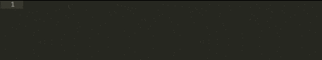

sublime-css-snippets
====================

CSS helpers for sublime text's snippet constructors. All of the tab commands begin with `css-` and will show up on your helper window when searching. Each has specific tab variables that you can tab through once initiating your snippet to edit the specific parameters for the css properties.

Put the snippets in `/Packages/User/` within Sublime Text.